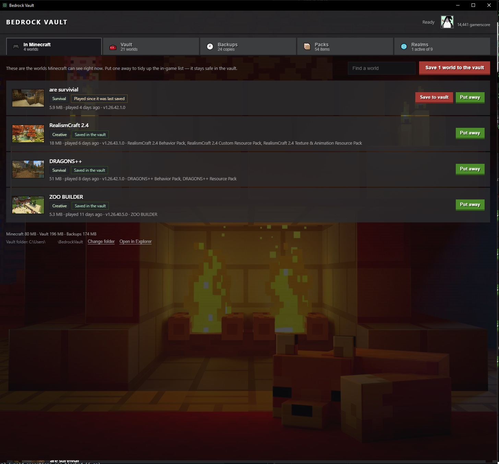
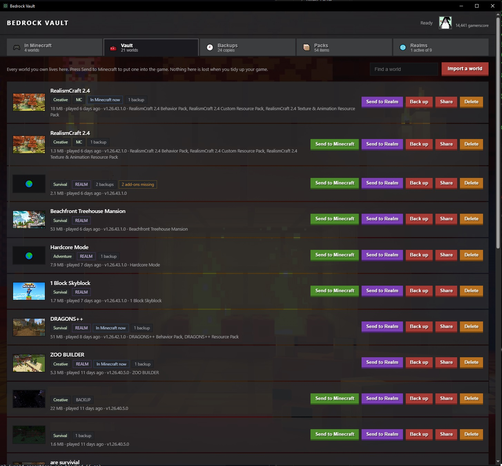
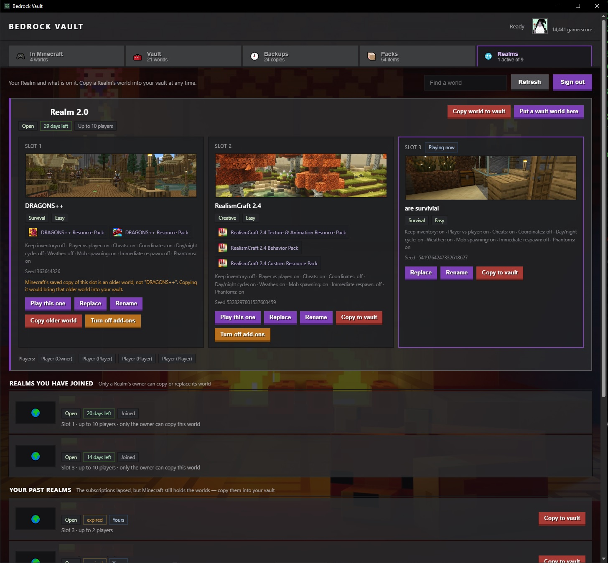

# Bedrock Vault

Local world library manager for **Minecraft Bedrock** on Windows. Keep an unlimited library of worlds on disk, curate which ones appear in the in-game list, and back everything up automatically — the in-game world list and the 3 Realm slots become *hot slots* fed from the vault.

A desktop app (Tauri 2) and a `vault` CLI that does everything the app does, over the same Rust core.

See [DESIGN.md](DESIGN.md) for the full design, and the [changelog](CHANGELOG.md) for what each release changed.

## Status

**v0.2.0** — twelve issues found by using v0.1.0 in earnest. The vault no
longer makes duplicate worlds or duplicate backups, Realm slots show the
picture and the named add-ons of the world really on them, and a Realm left
closed can be opened from the app. See the changelog's *Known limits* for what
is not in it.

| Milestone | State |
|---|---|
| M0 — format spike (`level.dat` parsing, `.mcworld` round-trip) | Done |
| M1 — library (world list, put away/play, backups, process guard) | Done |
| M2 — import/export, rename, retention, configurable vault folder | Done |
| M3 — Realm sign-in, listing, slot download | Done |
| M4 — Realm upload with mandatory pre-backup | Done |

Verified against a live account and a live Realm, in both directions.

## What it does

### Worlds in the game



Every world Minecraft can see right now, in either storage layout, read
straight from `level.dat`: name, game mode, difficulty, version, size, when it
was last played, and the add-ons it uses.

- **Put away** takes a world out of the in-game list — it stays safe in the vault, so the list in the game holds only what you are actually playing
- **Save to vault** copies a world that has been played since its last copy, without removing it
- **Save N worlds to the vault** does the lot in one press
- Each row says where its copy stands — *Saved in the vault*, *Played since it was last saved* — so nothing is put away that has not been kept
- The footer totals what Minecraft, the vault and the backups occupy, and **Change folder** moves the vault anywhere you like, copying and verifying before it removes anything

### The vault



Every world you own in one place, however many that is, with its thumbnail,
size, version, add-ons and backup count.

- **Send to Minecraft** puts a world back into the in-game list; **Send to Realm** puts one on a Realm slot
- **Back up** takes a `.mcworld` snapshot; it says so instead of duplicating a world that has not changed
- **Share** exports a `.mcworld`; **Import a world** takes one in, from a file or a world folder
- **Delete** takes a snapshot first, and that snapshot is never pruned
- A tag says where each world last was — **MC**, **REALM**, **FILE** or **BACKUP** — and follows the world as it moves
- Worlds that arrive twice are stored once: an identical copy, whichever way it comes in, updates the entry rather than adding another
- A world missing an add-on it was built with says so
- A search box filters the list

### Backups

Every snapshot, grouped by world rather than by copy — imports and Realm
downloads of the same world fold together, worlds that merely share a name stay
apart. Restore any snapshot, or delete a single one without touching the world
or its other copies. Retention keeps the last five per world, and a backup is
named after its world even after that world is deleted.

### Packs

The marketplace content installed on this PC, with its own artwork, and which
of your worlds use each item. Worlds name their add-ons from their own pack
history too, so a world pulled down from a Realm names its content even when
none of it is installed here.

### Realms



Sign in with a Microsoft account by device code — the app never sees your
password — and your Realms come through in full.

- All three slots side by side: the world on each with its picture, game mode, difficulty, seed, add-ons and game rules, plus who plays there and how long the subscription has left
- **Copy world to vault** brings a slot's world down; **Put a vault world here** sends one up, after downloading what is already there
- **Play this one** switches which slot the Realm runs, **Rename** renames a slot's world, **Turn off add-ons** clears a slot's content
- A Realm of yours that is closed says so and offers **Open** right there
- Where Minecraft serves a slot's older backup instead of the world now on it, the app says so and offers **Copy older world** rather than promising the wrong one
- **Realms you have joined** and **Your past realms** are listed separately — a lapsed Realm's worlds can still be copied into the vault
- **Refresh** re-reads everything, so a world made from inside the game shows up without restarting

## Safety

- **Never operates while Minecraft is running.** The `db/` LevelDB is fragile; copying it under a live game produces corrupt worlds. The check runs continuously, and the header says whether the app is *Ready*
- **Backup before anything destructive.** Archive, delete and Realm upload all take a `.mcworld` snapshot first
- **Copy, verify, then remove.** Every copy is checked (file count + total size) before the source is touched, so a failure leaves the original intact
- A Realm is closed for a world swap and reopened afterwards even if the upload fails, and is put back on the slot it was playing

## Appearance

Styled after the Bedrock launcher. Buttons are coloured by where the action
lands — green for Minecraft, red for the vault, purple for a Realm, orange for
anything destructive. One of six wallpapers is chosen at random each launch,
and Ctrl+wheel (or Ctrl+plus/minus/0) scales the window between 60% and 200%,
remembered between launches.

## Layout

```
core/   world scanning, level.dat (little-endian NBT), .mcworld packaging, vault operations
cli/    the `vault` command — everything the app can do, scriptable
app/    Tauri 2 desktop shell; plain HTML/CSS/JS frontend, no npm build step
```

## Building

Requires a Rust toolchain and the WebView2 runtime (present on Windows 10/11 by default).

```
cargo build              # workspace: core + cli + app
cargo test               # core test suite
cargo run -p bedrock-vault-app
```

## CLI

```
vault scan               # every world across all Minecraft installs
vault packs              # installed store content + which packs each world uses
vault guard              # is Minecraft running? (world operations are blocked if so)
vault library            # worlds held in the vault
vault archive <world>    # move a live world into the vault (backup first)
vault activate <id>      # copy a vault world back into the in-game list
vault import <path>      # import a .mcworld or world folder
vault export <id>        # write a .mcworld into the vault's exports folder
vault backups            # every backup, grouped by world
vault where / move <dir> # where the vault lives, and moving it
```

Realms:

```
vault login / logout     # Microsoft sign-in (device code)
vault account            # who is signed in
vault realms             # every Realm on the account
vault realm <id>         # slots, worlds, add-ons, players
vault realm-download <id>          # copy a Realm's world into the vault
vault realm-upload <id> <world-id> # put a vault world on a Realm (--yes)
vault realm-name / realm-slot / realm-open / realm-close
vault api <path>         # GET any Realms path — the API is undocumented
```

The vault lives at `%USERPROFILE%\BedrockVault` unless `--vault <path>` is given.

## Supported installs

Both Bedrock storage layouts are detected automatically, including when the game has been moved to another drive:

- **GDK** (current launcher) — `%appdata%\Minecraft Bedrock\Users\<profile>\games\com.mojang\`
- **UWP** (legacy Store package) — `%localappdata%\Packages\Microsoft.MinecraftUWP_*\LocalState\games\com.mojang\`

## Disclaimer

Not affiliated with Mojang or Microsoft. Realm integration uses an unofficial, undocumented API that may break at any time — use it with your own account and your own Realms only.

MIT licensed.
